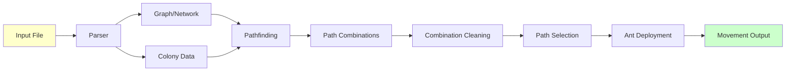
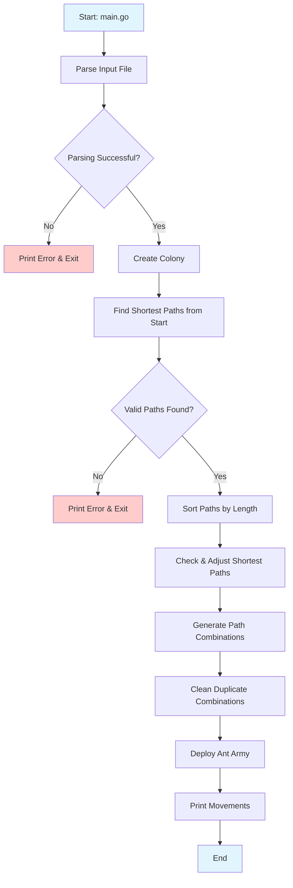
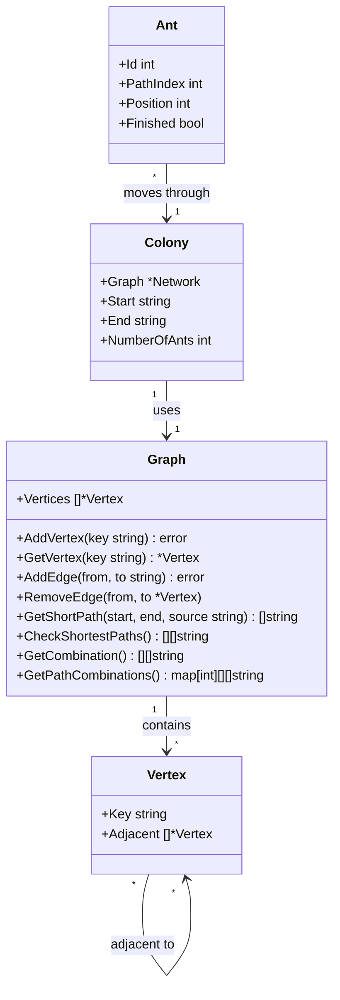
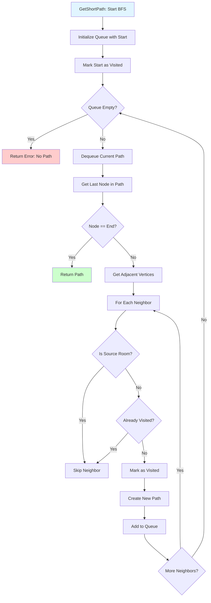
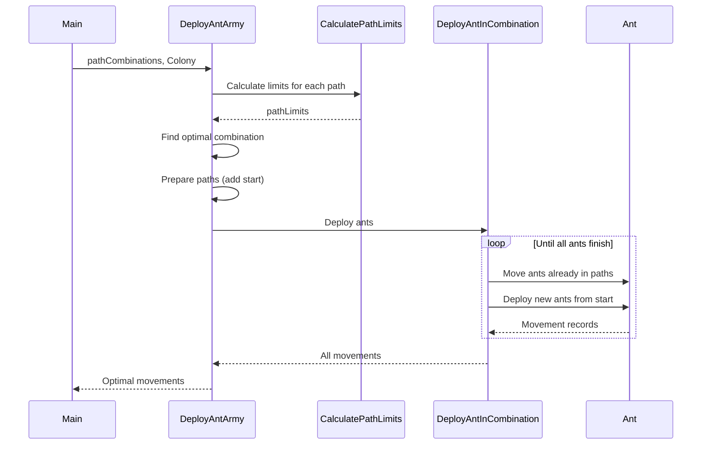
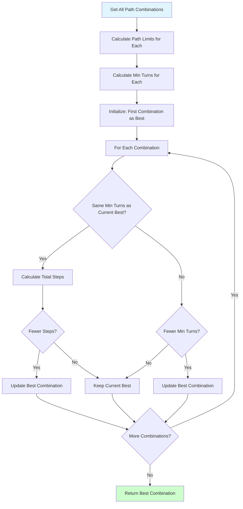

# Lem-In: Ant Farm Pathfinding Simulation

## Overview

**Lem-In** is a Go-based project designed to simulate a digital ant farm, where the goal is to find the optimal paths for ants to travel from a start room to the end room. The program reads colony data from an input file, processes it, and deploy the ants through the colony, displaying each ant's moves as they travel from room to room.

## Objectives

The main objectives of this project are:
- To create a digital ant farm with rooms and tunnels.
- To place ants at a starting point (`##start`) and guide them through the colony to the exit (`##end`).
- To determine the optimal possible paths for the ants while avoiding traffic jams and other obstacles.
- To handle various error cases like malformed input or disconnected colonies.

## How It Works

- The colony is described by rooms and tunnels between those rooms.
- Ants start in the `##start` room and must be moved to the `##end` room.
- The program finds the optimal way to move all ants while adhering to specific constraints:
  - Each room can only contain one ant at a time (except `##start` and `##end`).
  - Tunnels can only be used once per turn.
  
The program outputs the moves of the ants for each turn.

## Input File Format

The program takes a file describing the colony as input. The file contains:
1. **Number of ants**.
2. **Rooms**:
   - Each room is defined by its name and coordinates: `room_name coord_x coord_y`.
   - The starting room is denoted by `##start`, and the ending room by `##end`.
3. **Links (Tunnels)**:
   - A tunnel connecting two rooms is defined by `room_name1-room_name2`.

Example input file:
```
3
##start
1 23 3
2 16 7
3 16 3
4 16 5
5 9 3
6 1 5
7 4 8
##end
0 9 5
0-4
0-6
1-3
4-3
5-2
3-5
4-2
2-1
7-6
7-2
7-4
6-5
```

## Output Format

The program outputs:
- The content of the input file.
- The movements of the ants in the format `Lx-y` where `x` is the ant number, and `y` is the destination room.

Example output:
```
L1-3 L2-2
L1-4 L2-5 L3-3
L1-0 L2-6 L3-4
L2-0 L3-0
```

### Visualization: Data Flow



## Error Handling

The program must handle errors gracefully and output the following error message when applicable:
```
ERROR: invalid data format, + the specific error
```

## Constraints

- A room name must not start with 'L' or '#'.
- Each room must be connected to at least one other room via a tunnel.
- There can only be one tunnel between two rooms.
- The program must manage scenarios like:
  - No valid path from `##start` to `##end`.
  - Loops and self-referential rooms.
  - Invalid or poorly formatted input.

## Instructions

1. **Define Rooms and Tunnels**: Set up rooms and tunnels to form a colony for the ants to traverse.
2. **Ant Movement**: Move ants from the start to the end while following these rules:
   - Ants must take the shortest path where possible.
   - Avoid room congestion and tunnel blockages.
   - Ants can only move to an unoccupied room.
3. **Simulate Turns**: Each ant's movement from one room to another is displayed in turn-based format.

### Example 1
```
$ go run . test0.txt
3
##start
0 1 0
##end
1 5 0
2 9 0
0-2
2-3
3-1

L1-2
L1-3 L2-2
L1-1 L2-3 L3-2
L2-1 L3-3
L3-1
```

### Visualization: Main Program Flow



## Installation

1. Clone the repository:
   ```bash
   git clone https://learn.zone01oujda.ma/git/helazzou/lem-in.git
   ```
2. Navigate to the project directory:
   ```bash
   cd lem-in
   ```
3. Run the project with a test file:
   ```bash
   go run . <input_file>
   ```

## Architecture Diagrams

### Graph Structure and Relationships



### Pathfinding Algorithm (BFS)



### Ant Deployment Process



### Path Combination Selection


